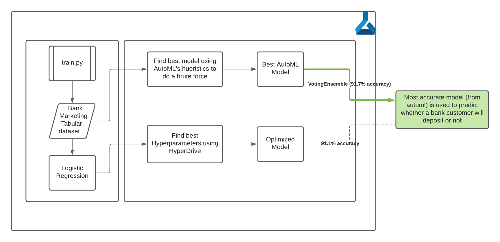
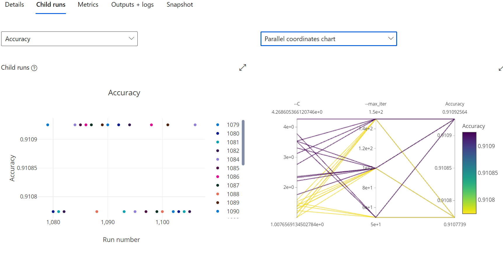
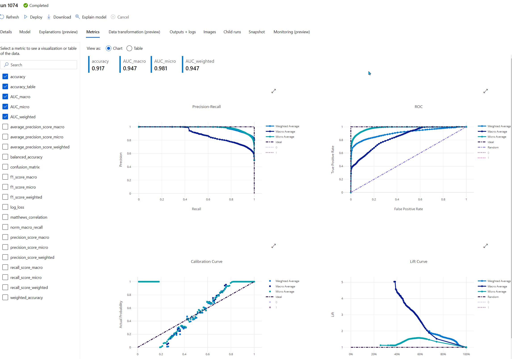
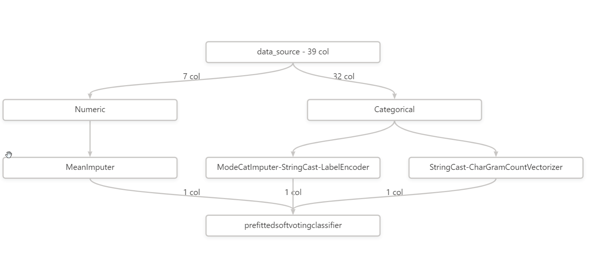
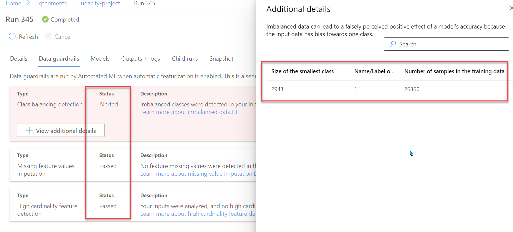
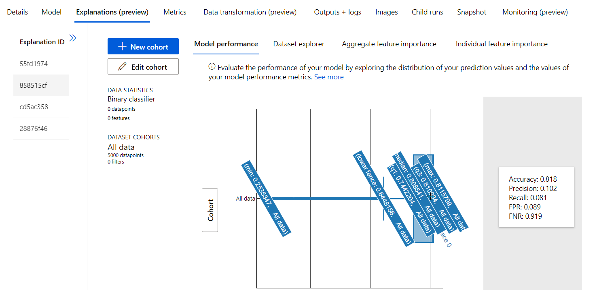

## Overview

This project is part of the Udacity Azure ML Nanodegree.

In this project, we build and optimize an Azure ML pipeline using the Python SDK and a provided Scikit-learn model.

This model is then compared to an Azure AutoML run.


## Summary

The [dataset](https://www.kaggle.com/henriqueyamahata/bank-marketing) deals with direct marketing campaigns of a bank. This is a classification problem to predict if the client will subscribe to a term deposit or not. 

The best model to predict this outcome has been identified using AutoML (as supposed to hyperparameter tuning of the given Scikit-learn Logisticregression script in train.py) with an accuracy of 91.7% (VotingEnsemble) as shown below:



## Scikit-learn Pipeline

*\*Explain the pipeline architecture, including data, hyperparameter tuning, and classification algorithm.\*

First we create a workspace from config and define a compute target to execute the sci-kit learn script (train.py), for which a starting template was provided. In this training script, we run a logistic regression with inverse regularization (`C`) and maximum iterations (`max_iter`) as hyperparameters. The data is cleaned with one-hot encoder and other categorical transformations with lambda functions to gold format for sklearn's logistic regression training. In addition, the train and test datasets are split 80-20. The hyperparameters are randomly sampled and passed to the method in train.py during hyperdrive executions. The one that yields the most accuracy is chosen as the optimized hyperparameter settings, which, in this case has a `C` value of `1.4120987698738543` and `max_iter` of `100` , resulting in an accuracy of `91.1%`. 

*\*What are the benefits of the parameter sampler you chose?\**
Random sampling over a hyperparameter search space supports discrete and continuous hyperparameters, and I have tried both but ended up with `loguniform`. It also allows early termination of low-performance runs. It's faster and optimal than grid and bayesian and can be used as an initial heuristic to get good metrics. 



*\*What are the benefits of the early stopping policy you chose?\*
This allows efficient usage of cloud resources and is a cost-efficient way to eliminate low-performance runs to use up compute costs. We used Bandit policy, which uses slack factor and evaluation interval. Bandit ends runs when the primary metric isn't within the specified slack factor of the most successful run, which in our case is: `{"evaluation_interval":1,"delay_evaluation":0,"slack_factor":0.1}`

Bandit Policy is a more aggressive savings policy than other termination policies as it has a smaller allowable slack. This elastic nature is a good option for cloud-based ml work as it optimizes the costs, which is otherwise impossible to acheive. And since cloud costs are usage based, it's very important to pick an aggressive termination policy like Bandit. 


## AutoML

AutoML definitely took more compute resources and performed a more exhaustive search (696 models) for this classification problem. The most accurate one was `VotingEnsemble` followed by `StackEnsemble` and several `XGBoostClassifiers` with over 91% accuracy. `VotingEnsemble` with an accuracy of `91.7%` was the highest with AUC weighted of  `94.74%`, which is a better metric for classification.




Some of the guardrails that it used was around training time, which was set to 0.5 hours, and metric score threshold, which was set to 0.99 for exit criterion. In addition, it also disabled deep learning and blocked `TensorFlowLinearClassifier` and `TensorFlowDNN` algorithms. In addition, it also used `k-fold cross validation` to validate the model's accuracy. 

THe run also had some data guardrails that it passed - `Missing features values imputation` and `High cardinality feature detection`. However it did not pass `Class balancing detection`, which Automl altered as the imbalanced data can lead to a falsely perceived positive effect of a model's accuracy because the input data can be biased towards one class.



## Pipeline comparison
The accuracy delta between both approaches is negligible (0.6%), however, a better classification metric, AUC weighted, is higher for the VotingEnsemble model that AutoML's search space found. AutoML can definitely close the gap of unkown-unkowns as it's more exhaustive than tuning a predefined model's hyperparameters. Parallelizing, when compute is available, can yield faster times, which in my case was possible as I was using work resources rather than labs, which was constrained.


## Future work
I know we did not delve into neural-networks for both automl and hyper parameteric tuning as this is a classification problem. However, since we have a large enough dataset, it might be worthwhile to see if DNNs can provide a better model to interpolate this search space and provide a more accuracy score.

## Proof of cluster clean up

Used personal azure resources that I got from work. However, did delete the cluster at the end of the notebook with the following method call: 
```python
compute_target.delete()
```
